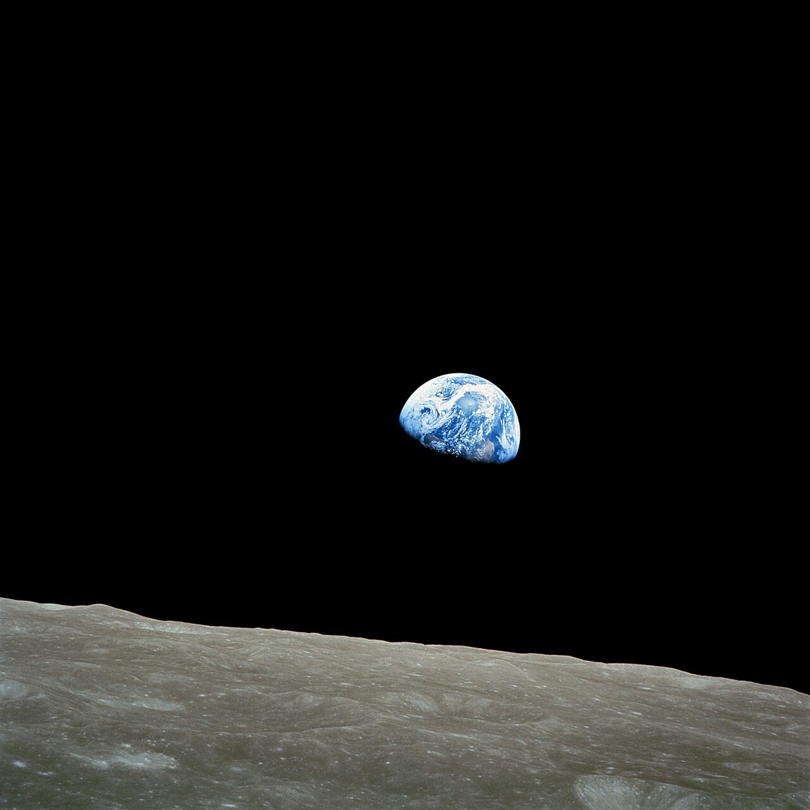
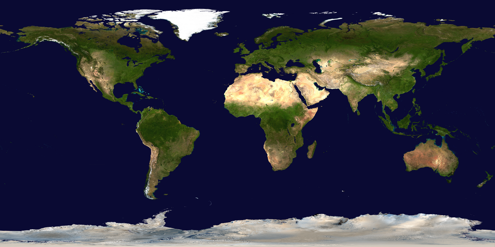
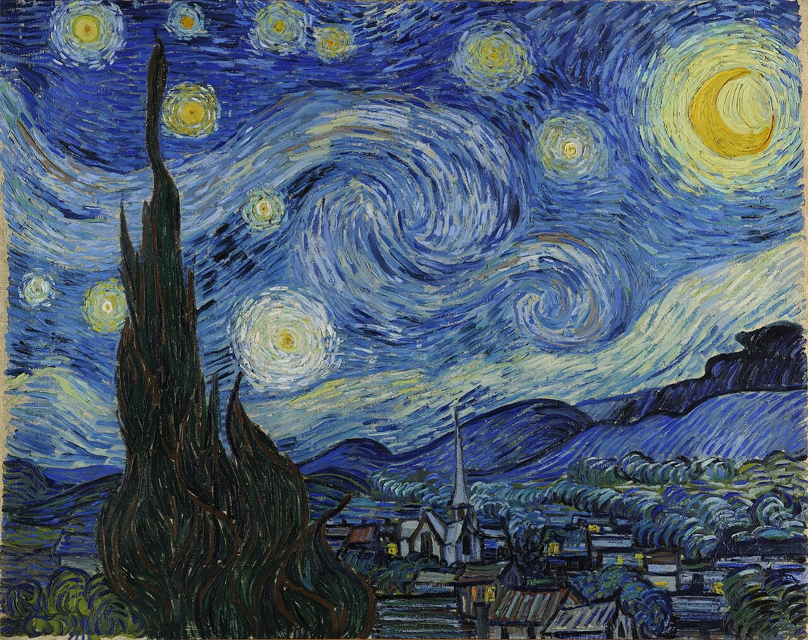
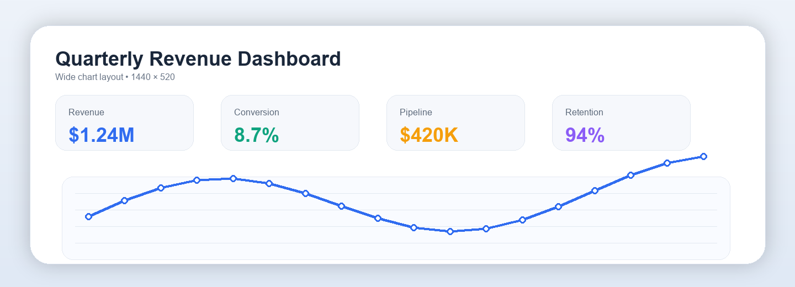
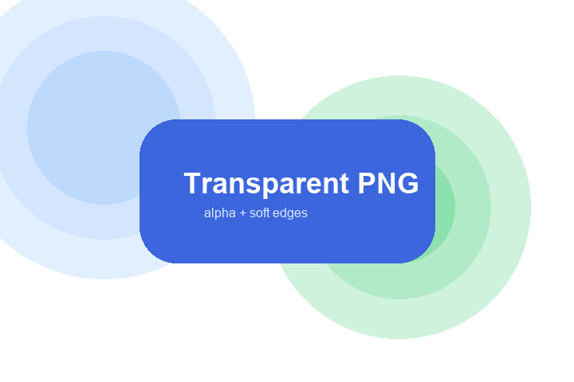
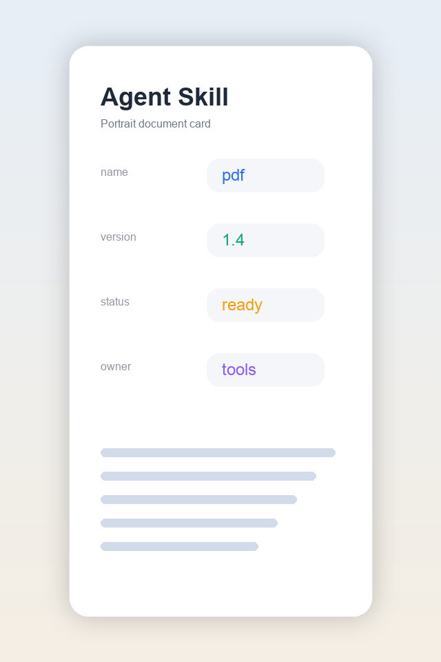
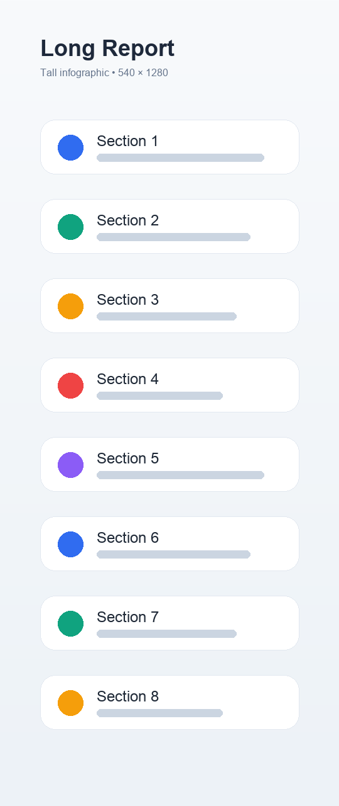
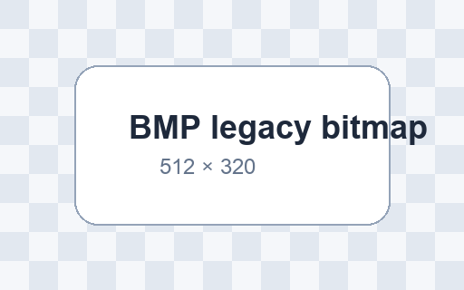
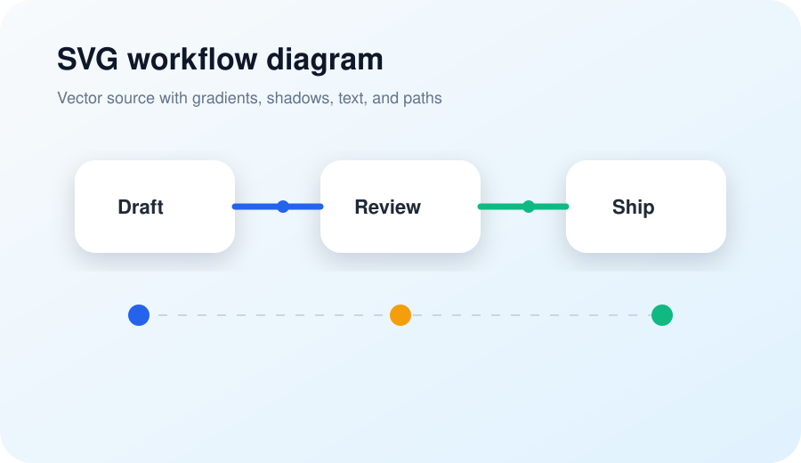

# Markdown Image Fixture Gallery

This file exists to exercise the image renderer with reusable local assets.

## JPEG Photo-like Landscape

## Public-domain JPEG Photo

## Public-domain PNG Photo

## Public-domain Artwork JPEG

## PNG Dashboard

## WebP Night Scene

## Animated GIF

## Animated WebP

## Transparent PNG

## Portrait PNG

## Tall PNG

## TIFF

## BMP

## JPEG 2000

## SVG

## Captionless Image

## Missing Image

## Inline Image Should Stay Inline

Before  after.

## Linked Image

## Reference-style Image

![Referenced WebP scene][city-webp]

[city-webp]: ../media/valid/markdown-images/city-night.webp
